## HUAJI OS 操作系统课程设计说明文档

> ### 1652746 邹笑寒 

[TOC]

### 一、设计思路

参考了ORANGES提供的源码，对其进行了一些完善和内容的添加。操作系统的GUI采用了控制台的形式。

实现了课程设计所要求的B、C、D三个难度：

难度B：对参考源码的文件系统和进程管理系统进行修改

- 二级文件系统：

  Orange的文件系统只实现了一级的文件系统，这不符合平时的使用习惯，因此我在这个基础上实现了多级文件文件系统。

- 记忆恢复：

  Orange的文件系统不具有文件记忆功能，在操作完文件完成硬盘读写之后关机再次开机文件系统会默认没有任何文件，因此我实现了记忆功能，可以将关机之前的操作全部恢复。

- 进程管理：

  Oranges系统实现了进程管理的基础框架，却缺少任务管理器的部分。因此我添加了一个类似的功能，可以实现进程的查看、删除、调整优先级、挂起和恢复。

难度C：完善了控制台的命令解释器，通过在shell上输入指令可以进行文件操作、进程操作和查看信息。

难度D：实现4个应用程序，包括贪食蛇游戏（snake）、五子棋游戏（gobang）、简易计算器（calculator）和扫雷游戏（minesweeper）。

### 二、项目组成

 >boot（引导） 

 >kernel（内核及应用） 

 >fs（文件系统）

 >lib（可用代码库） 

 >include（头文件） 

### 三、功能说明

#### （一）、系统级功能

##### 1.多级文件系统

- 多级目录：对文件系统进行了修改，使得文件系统变成了多级的文件系统。可以进行通过cd进出文件夹、通过ls参看文件夹内容、通过touch新建文件等8项操作。
- 记忆恢复：实现了文件系统的记忆功能，再次开机后讲读取特殊文件将关机前的操作全部恢复。

##### 2.进程管理

	实现了进程的查看、删除、调整优先级、挂起和恢复。通过遍历proc_table，按照一定的格式输出进程表中的信息，在屏幕上显示进程名、优先级、当前状态等信息。可根据用户提供的进程id，使用系统调用，找到并删除当前进程表中对应的用户进程，并将该项的p_flags置为空；或通过修改run_state来实现进程的挂起和恢复；或通过修改priority来实现优先级的调整。

#### （二）、用户级功能

##### 1.贪食蛇（snake）

输出一张15*35的地图，随机生成蛇的位置和每个食物的位置。读取用户的输入键（a、s、d、w）来修改蛇的前进方向。蛇吃掉食物后蛇身会变长。通过不断清屏和重新输出地图及蛇和食物的最新状态来实现蛇的动态移动显示。蛇撞到墙后游戏结束，将显示“game over”画面并在3秒后退出。

##### 2.五子棋（gobang）

输出一张9*9的地图，player1和player2交替输入落子坐标来进行玩家对战，player的落子显示为‘X’，player的落子显示为‘O’。任何一方实现五子连线都将显示该放获胜并退出。按‘e’可以直接退出游戏。

##### 3.简易计算器（calculator）

输入两数相加、相减、相乘或相除，然后输出结果。

##### 4.扫雷（minesweeper）

输出一张10*10的地图，随机生成15颗雷。输入x，y坐标来翻开方块，若翻到雷则游戏结束并显示所有雷的位置。否则计算该空白块周围一圈雷的个数，若为零，则翻开该块并对周围八个块重复该步骤；若不为零，则翻开并显示周围雷的个数。空白快自动扩展算法用Dfs来实现。

### 四、功能展示

#### 1.开机画面及welcome

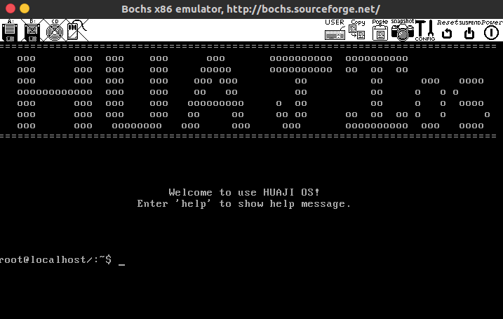

开机后将显示欢迎界面，和“输入‘help’来查看帮助信息”的人性化提示。在shell中输入welcome也将显示该界面。

#### 2.清屏（clear）

输入clear将清空屏幕。

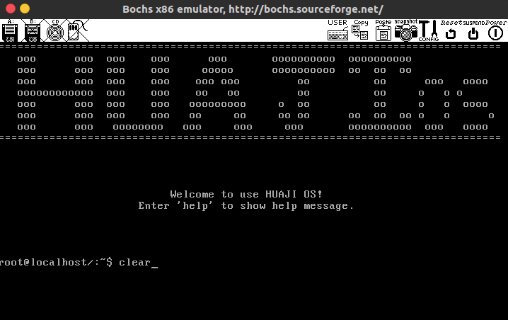

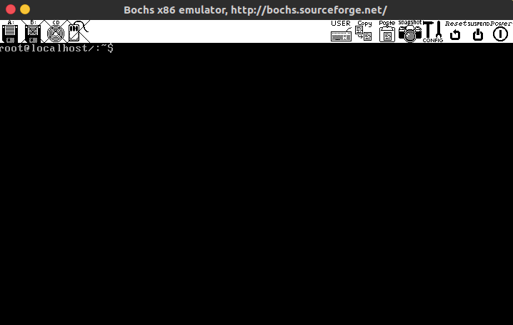

#### 2.文件操作

##### a.新建文件（touch）

输入“touch [文件名]”将在当前路径下新建文件。

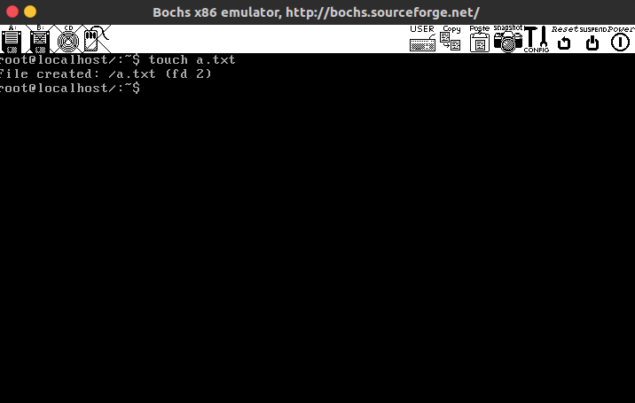

输入“touch [文件路径]”将在该路径下新建文件。

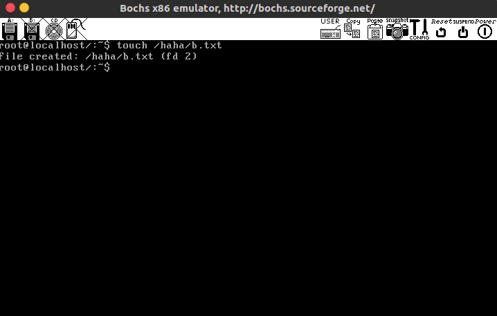

##### b.显示当前目录下内容（ls）

输入ls将显示当前目录下内容。

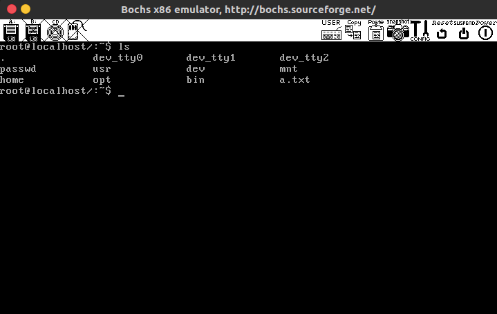

##### c.编辑文件（vi）

输入“vi [文件名]”或“vi [文件路径]”可以对该文件进行编辑。

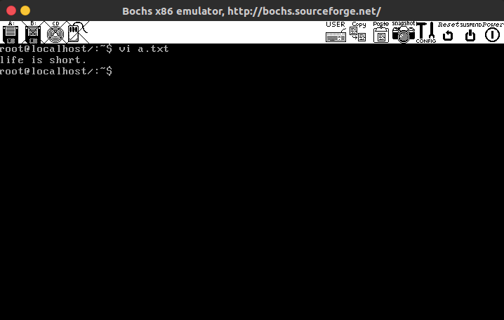

##### d.打开文件（cat）

输入“cat [文件名]”或“cat [文件路径]”将打开该文件。

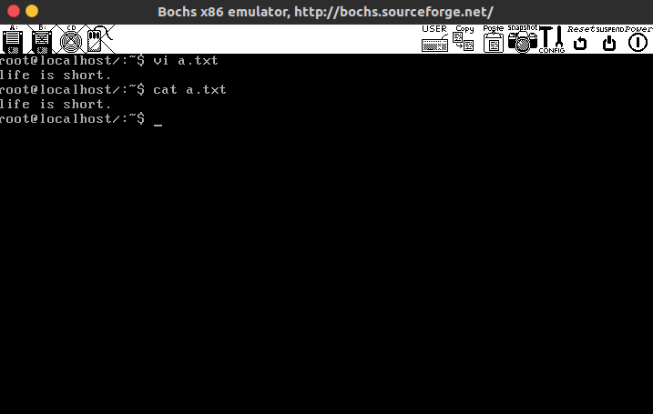

##### e.加密文件（encrypt）

输入“encrypt [文件名]”或“encrypt [文件路径]”然后输入密码可以对该文件进行加密。

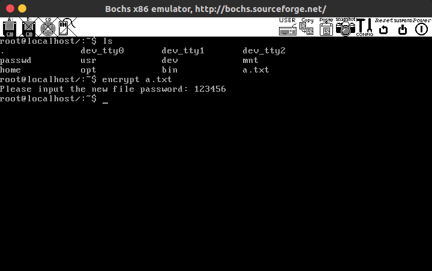

##### f.删除文件（rm）

输入“rm [文件名]”或“rm [文件路径]”将删除该文件。

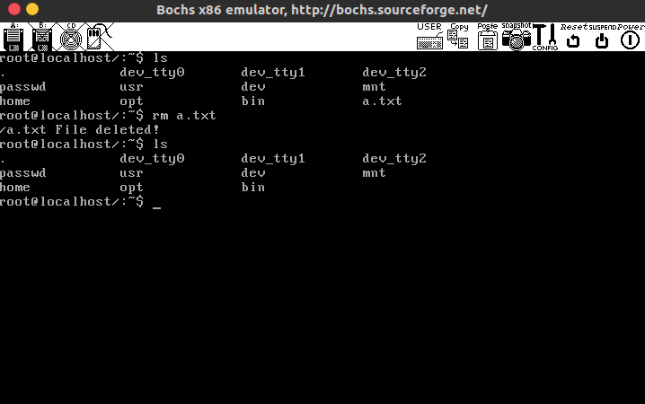

##### g.新建文件夹（mkdir）

输入“mkdir [文件夹名]”或“mkdir [文件夹路径]”将新建该文件夹。

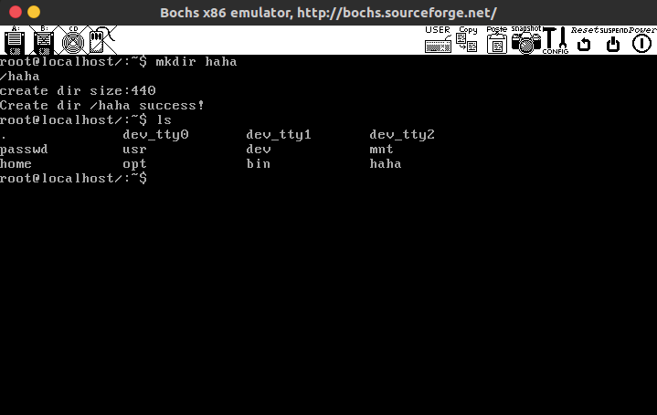

##### h.进入文件夹（cd）

输入“cd [文件夹名]”或“cd [文件夹路径]”将进入该文件夹。

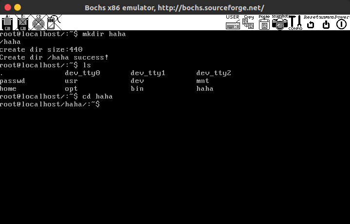

#### 3.进程管理

在shell中输入process将进入进程管理页面。

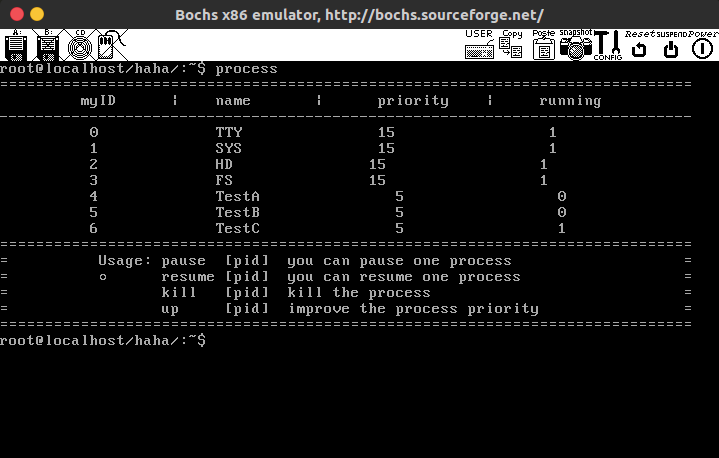

##### a.挂起进程（pause）

输入“pause [进程号]”将挂起该进程，running状态显示为0。

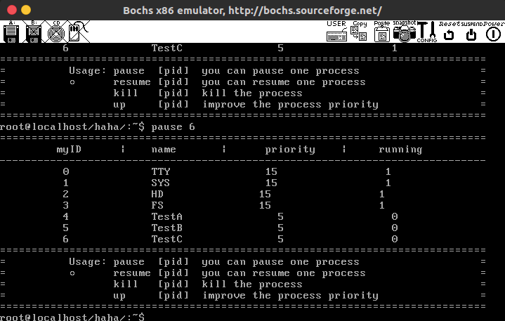

##### b.杀死进程（kill）

输入“kill [进程号]”将杀死该进程，该进程从列表中删除。

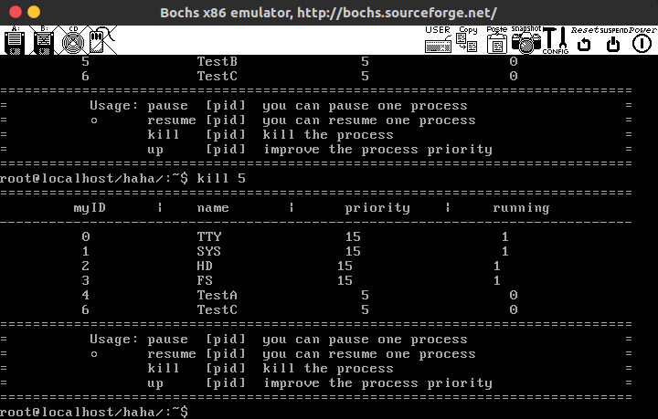

##### c.恢复进程（resume）

输入“resume [进程号]”将恢复该进程，running状态显示为1。

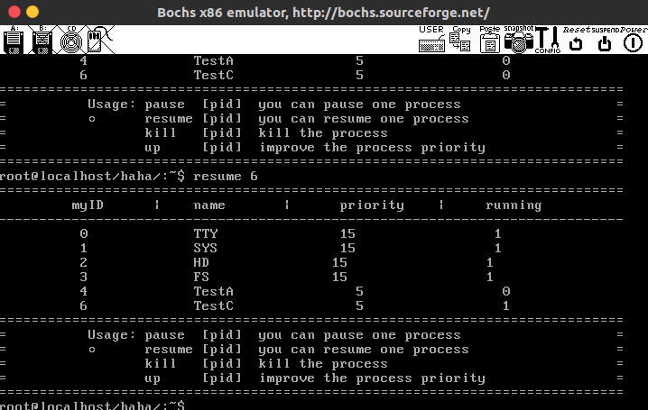

##### d.调整优先级（up）

输入“up [进程号]”可以将该进程优先级翻倍。

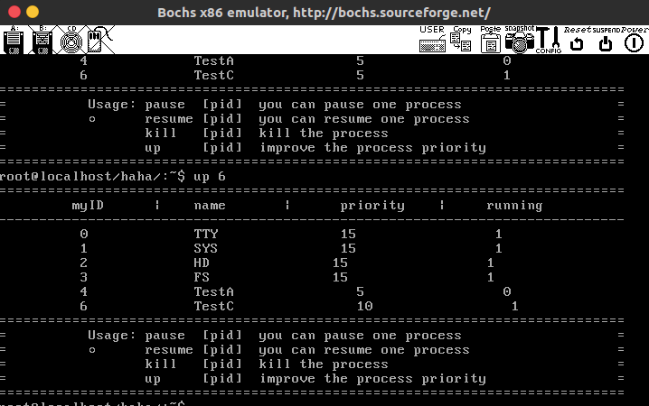

#### 4.相关信息（about）

在shell中输入about将显示相关信息。

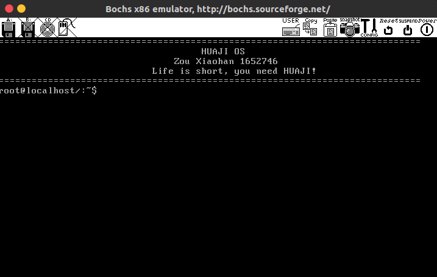

#### 5.贪食蛇游戏（snake）

输入snake将进入贪食蛇游戏。

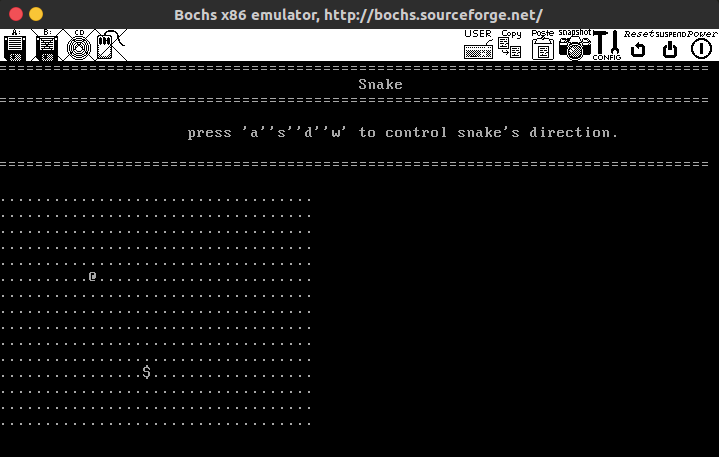

按‘a’‘s’‘w’‘d’控制设的前进方向，蛇每吃一个食物蛇身都会变长。

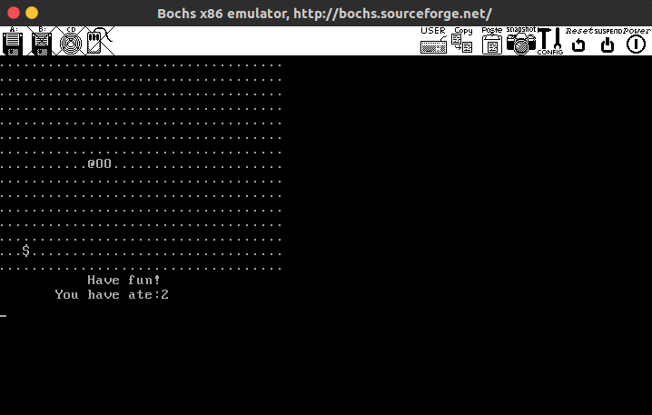

蛇撞墙后游戏结束，将显示“game over”画面并在3秒后退出。

#### 6.扫雷游戏（minesweeper）

输入minesweeper将进入扫雷游戏。

输入要翻开的方块的x和y坐标：

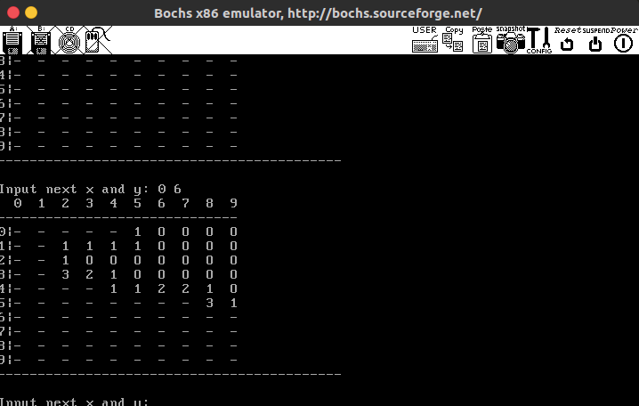

如果翻开雷则游戏结束，并显示所有雷的位置：

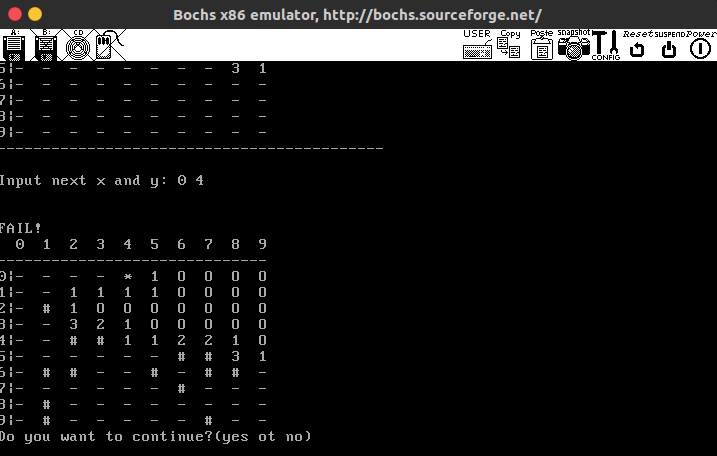

输入yes再来一局，输入no退出。

可以随时输入e来退出游戏。

#### 7.五子棋游戏

输入gobang进入五子棋游戏。

player的棋子显示为X，player2的棋子显示为O，两者交替落子：

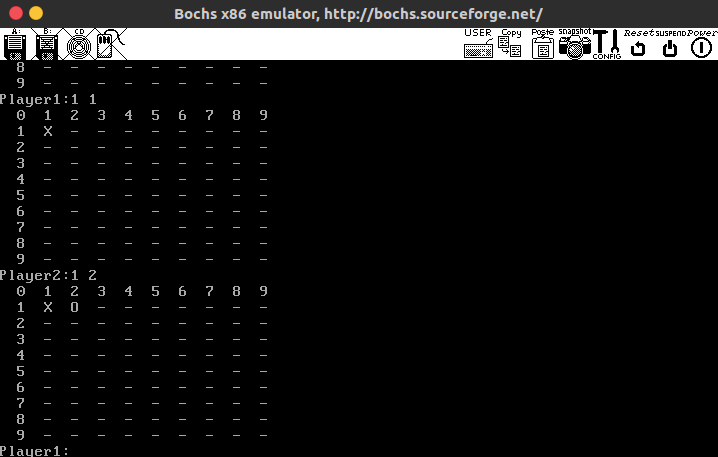

若任何一方五子连线，显示该玩家获胜：

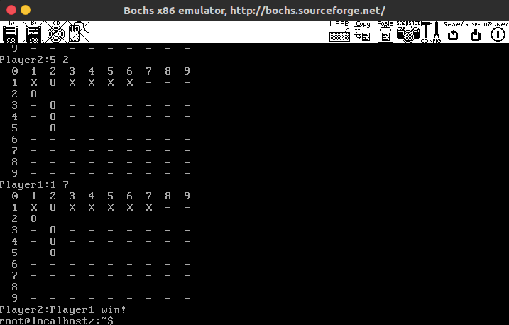

可以随时输入e来退出游戏。

#### 8.简易计算器（calculator）

输入calculator进入简易计算器，可进行简单运算。

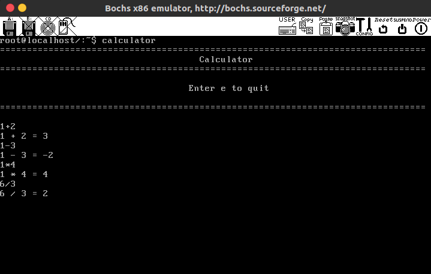

可以随时输入e来退出计算器。

#### 五、开发环境

> Ubuntu 16.04 64位 

> bochs 2.6.9 

#### 六、项目托管地址

https://github.com/Renovamen/HUAJI_OS

#### 七、安装说明

- 首先请确认已安装好Ubuntu 和 bochs，本项目默认运行在 64 位系
  统中，如果是 32 位需要修改Makefile。
- 在终端中进入项目目录：

> cd HUAJI_OS

- 从80m.tar.xz中解压出80m.img，这里采用unar:

> sudo apt-get install unar
>
> unar 80m.tar.xz

- 如果是32位系统，需要修改Makefile中的LD及gcc参数（删除-m32和-m elf_i386 参数）。
- bochsrc中的romimage，vgaromimage和keymap的路径可能需要根据bochs的具体安装路径进行修改。
- 编译运行：

> sudo make image
>
> bochs -f bochsrc

- 然后输入回车和c（退出调试模式）即可。

